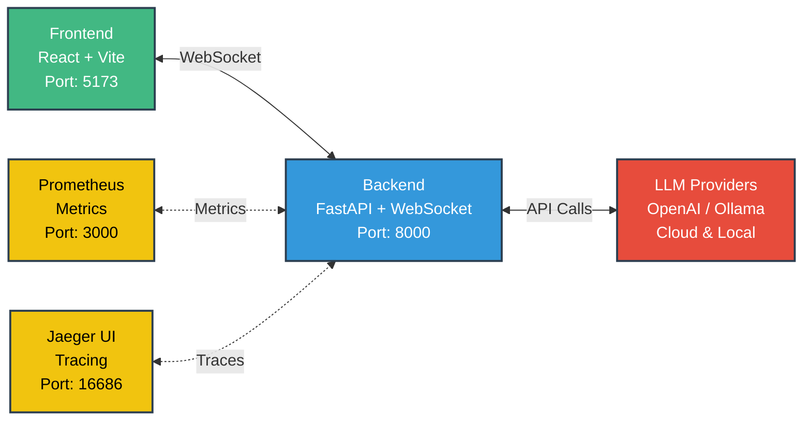

# Chat Starter

A real-time chat application integrating multiple Large Language Models (LLMs) – **OpenAI**, **Ollama**, and **LLaMA** – with WebSocket communication, observability, and local deployment using Docker.

## Architecture Overview



## Components

### Frontend
- React + Vite
- WebSocket UI
- Supports switching between LLMs

### Backend
- FastAPI + WebSocket server
- Routes messages to selected LLM

### LLMs
- **OpenAI**: Cloud-based, requires API key
- **Ollama**: Local LLM, free usage, no API key needed
- **LLaMA**: Optional local LLM integration

### Observability
- Prometheus (metrics)
- Jaeger (tracing)

## Features
- Real-time WebSocket chat
- Dynamic LLM selection (`/use openai`, `/use ollama`, `/use llama`)
- Metrics collection via Prometheus
- Distributed tracing via Jaeger
- Local-first deployment using Docker

## Setup Instructions

### 1. Clone the repository
```bash
git clone <your-gitlab-repo-url>
cd chat-starter
```

### 2. Backend setup
Create `.env` in backend folder:
```env
OPENAI_API_KEY=<your_openai_api_key>
MODEL=gpt-4-turbo
```

Install Python dependencies:
```bash
pip install -r requirements.txt
```

### 3. Frontend setup
Navigate to frontend folder:
```bash
cd frontend
npm install
```

### 4. Docker Setup
Build and start all services:
```bash
docker compose up --build
```

Access services:
- Frontend: http://localhost:5173
- Backend API: http://localhost:8000
- Prometheus: http://localhost:3000
- Jaeger: http://localhost:16686
- Ollama (if local): default port 11434

## Quick Start Commands

### Development Mode (Hot Reload)

**Backend:**
```bash
docker compose up backend  # FastAPI + WebSocket
```

**Frontend:**
```bash
docker compose up frontend  # React UI
```

**Ollama:**
```bash
ollama serve  # Default port: 11434
```

**Prometheus & Jaeger:**
```bash
docker compose up prometheus jaeger
```

### Production Mode (Detached / Background)
```bash
docker compose up --build -d
docker compose ps
docker compose logs -f backend
```

## LLM Switching
Default: OpenAI

Commands in chat box:
- `/use openai` → Use OpenAI API
- `/use ollama` → Use local Ollama model
- `/use llama` → Use LLaMA local model (if configured)

## Metrics & Tracing
- **Prometheus**: Collects HTTP & WebSocket metrics
  - Example: `http_requests_total`, labeled by path
- **Jaeger**: Distributed tracing for requests

## Troubleshooting

### OpenAI quota exceeded
```
openai.RateLimitError: insufficient_quota
```
→ Use `/use ollama` to switch to local LLM.

### WebSocket connection issues
- Ensure frontend and backend ports are correctly exposed
- Confirm Docker network connectivity

### Ollama errors
- Check model is downloaded: `ollama list`
- Pull new model if missing: `ollama pull <model_name>`

## Useful Commands

| Command | Purpose |
|---------|----------|
| `docker compose stop` | Stop all running services |
| `docker compose down` | Stop & remove containers and network |
| `docker compose logs -f frontend` | Follow frontend logs |
| `docker compose exec backend /bin/sh` | Open shell inside backend container |
| `docker compose exec frontend /bin/sh` | Open shell inside frontend container |
| `ollama list` | List local Ollama models |
| `ollama pull <model>` | Download Ollama model locally |

## License
MIT License